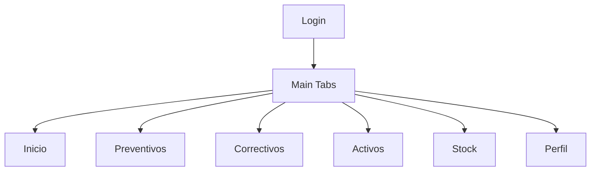
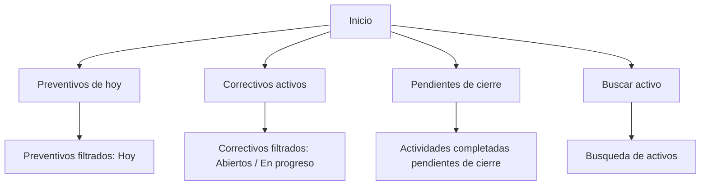
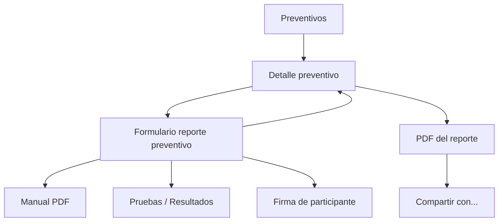
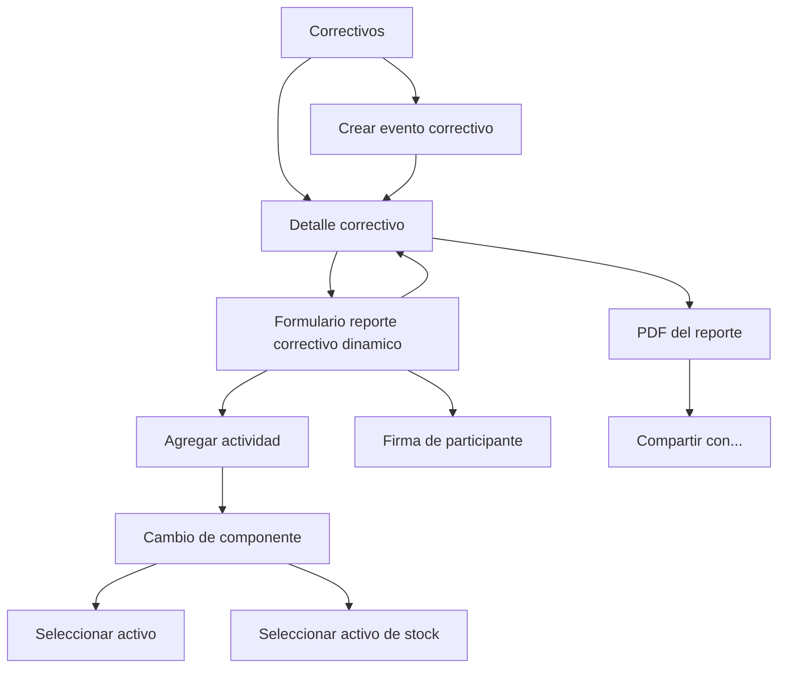
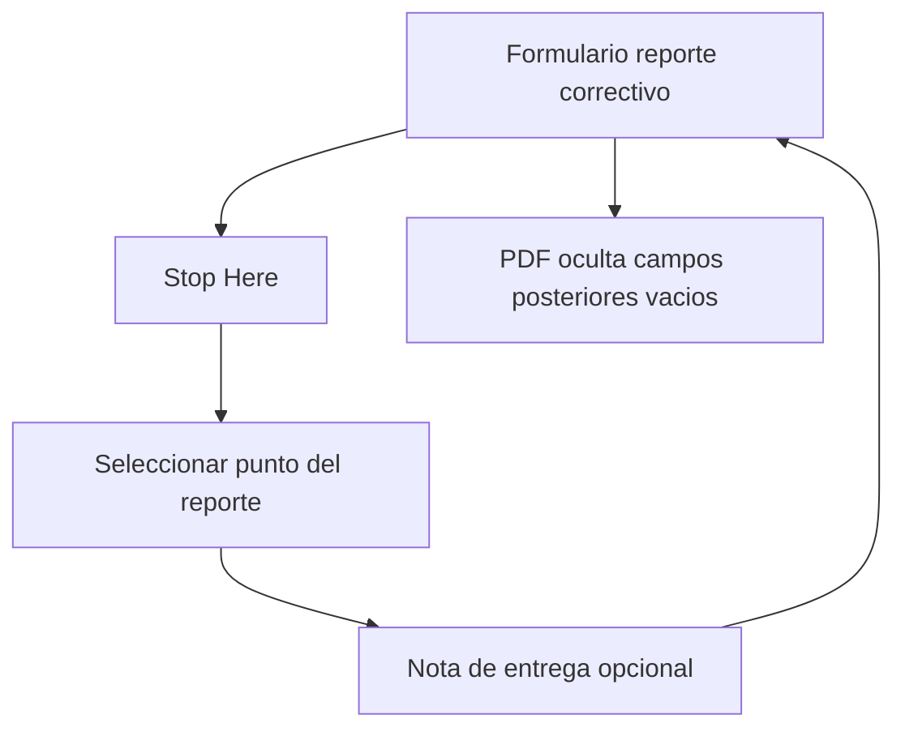
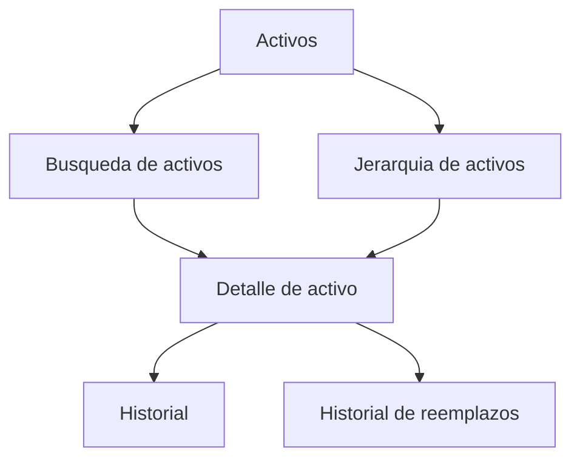
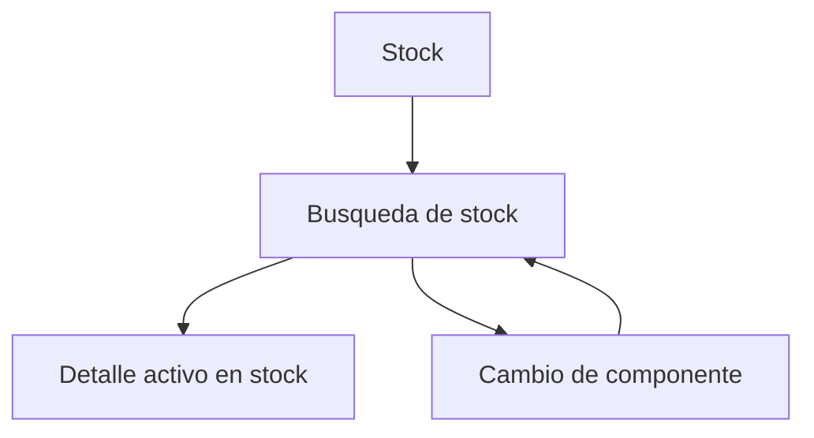
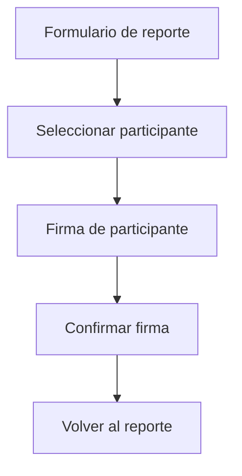
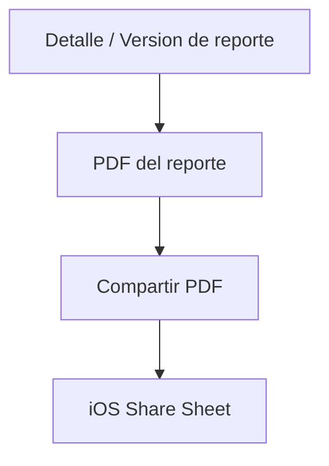

# iPad Navigation Map

**Version:** 0.1  
**Status:** Draft  
**Last Updated:** 2026-06-17

---

## 1. Purpose

This document defines the navigation structure for the mock-first iPad prototype.

Documentation is written in English. App-visible labels and data are written in Spanish.

---

## 2. Root Navigation

---

## 3. Home Navigation

---

## 4. Preventive Navigation

### 4.1 Preventive State Actions

| Status | Navigation |
|--------|------------|
| Programado | Detalle preventivo -> Iniciar -> Detalle preventivo En progreso |
| En progreso | Detalle preventivo -> Formulario reporte preventivo |
| Completado | Detalle preventivo -> Reabrir a En progreso / PDF / Cerrar if Coordinator |
| Cerrado | Detalle preventivo -> View only / Reabrir a En progreso if Coordinator |

Additional detail behavior:

- Detalle preventivo muestra `Acciones` despues de la imagen del equipo grande y antes de datos generales.
- Los preventivos completados pueden reabrirse a `En progreso` por Ingeniero de Mantenimiento, Coordinador o Administrador; Jefe queda en solo lectura.
- Los preventivos cerrados solo pueden reabrirse a `En progreso` por Coordinador o Administrador.
- `Reportes anteriores` navega desde cada historico a una vista previa PDF del reporte realizado en ese momento.
- Los comentarios preventivos son reutilizables por tipo de mantenimiento y/o equipo grande para futuras ejecuciones.

---

## 5. Corrective Navigation

### 5.1 Corrective State Actions

| Status | Navigation |
|--------|------------|
| Programado / Abierto | Detalle correctivo -> Iniciar |
| En progreso | Detalle correctivo -> Crear/Editar reporte |
| Completado | Detalle correctivo -> Reabrir a En progreso / PDF / Cerrar if Coordinator |
| Cerrado | Detalle correctivo -> View only / Reabrir a En progreso if Coordinator |

Additional detail behavior:

- Detalle correctivo incluye `Comentarios del correctivo`.
- Estos comentarios se asocian solo al evento correctivo actual; no se reutilizan en futuros correctivos del mismo equipo.
- Las acciones correctivas usan la misma grilla adaptable con iconos que preventivos.
- Los correctivos completados pueden reabrirse a `En progreso` por Ingeniero de Mantenimiento, Coordinador o Administrador; Jefe queda en solo lectura.
- Los correctivos cerrados solo pueden reabrirse a `En progreso` por Coordinador o Administrador.
- Las acciones aparecen arriba del detalle, antes de `Datos del evento`, para que iniciar, crear reporte, completar o cerrar no quede al final del scroll.
- `Etapa` es metadata del proyecto; `Ubicacion fisica` debe venir del equipo grande/asset seleccionado y no debe mostrarse como rama seleccionable del arbol.
- En cambio de componente, el asset retirado muestra la ruta completa seleccionada en el arbol. El componente a reponer se selecciona desde un sheet `Seleccionar el componente a reemplazar` con buscador y lista filtrada por almacen.

### 5.1.1 Corrective List Filters

- `Correctivos` incluye filtros opcionales `Hoy`, `Esta semana`, `Este Mes` y `Mes especifico`.
- Si no hay filtro activo, la lista muestra correctivos abiertos, en progreso, completados y cerrados.
- Si hay filtro activo, se filtra por `Fecha y hora de creacion de aviso`.
- La busqueda textual filtra por nombre del evento, codigo, SAP o equipo afectado.

### 5.2 Stop Here Navigation

Stop Here does not navigate to a separate partial report state. It only stores a marker used for report/PDF visibility.

---

## 6. Asset Navigation

### 6.1 Asset Picker Reuse

Asset picker can be opened from:

- corrective event creation,
- corrective replacement block,
- preventive activity detail,
- asset search shortcut.

---

## 7. Stock Navigation

Stock selection is primarily used by corrective component replacement.

---

## 8. Signature Navigation

---

## 9. PDF and Share Navigation

App-visible mock labels:

- `PDF del reporte`
- `Compartir PDF`
- `Compartir con...`

---

## 10. Role-Based Navigation Rules

| Role | Hidden or Disabled Navigation |
|------|-------------------------------|
| Technician | Cannot close/reopen activities |
| Coordinator | Can close/reopen activities |
| Boss | Cannot create/edit/start/complete/close/reopen; read-only navigation only |
| Administrator | No restrictions in mock |

---

## 11. First Prototype Navigation Scope

The first SwiftUI mock should implement:

1. Inicio -> Preventivos de hoy -> Detalle preventivo
2. Preventivo -> Formulario reporte preventivo -> Firma -> PDF
3. Inicio -> Correctivos activos -> Detalle correctivo
4. Correctivo -> Formulario dinamico -> Cambio de componente -> Stock
5. Activos -> Busqueda -> Detalle de activo
6. Report version -> PDF preview -> Share Sheet placeholder

Everything else can be a placeholder screen in the first prototype.
